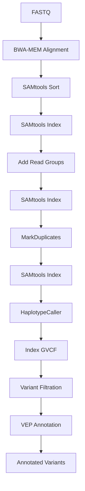
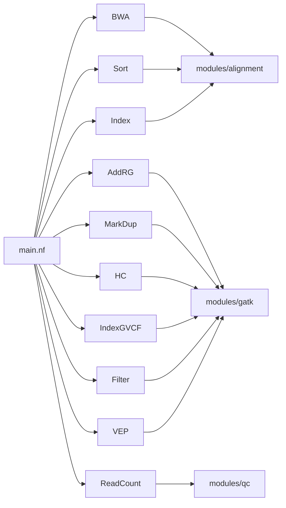

# Modular Germline Variant Calling Pipeline using Nextflow DSL2


---

## Overview

This repository contains a modular **Nextflow DSL2** pipeline implementing the **GATK Best Practices** workflow for germline variant discovery from next-generation sequencing (NGS) data.

The workflow performs read alignment, BAM processing, duplicate marking, germline variant calling, variant filtration, and functional annotation using the Ensembl Variant Effect Predictor (VEP). Each analysis step is implemented as an independent DSL2 module, making the pipeline reproducible, scalable, and easy to extend.

---

## Features

- Modular Nextflow DSL2 workflow
- Read alignment using **BWA-MEM**
- BAM sorting and indexing with **SAMtools**
- Read group assignment using **GATK AddOrReplaceReadGroups**
- PCR duplicate marking using **MarkDuplicates**
- Germline variant calling using **GATK HaplotypeCaller**
- Variant filtration using **GATK VariantFiltration**
- Functional annotation using **Ensembl VEP**
- Reproducible and scalable workflow execution
- Easily extensible modular architecture

---

---

# Pipeline Workflow



---

## Directory Structure

```text
nextflow-germline-variant-pipeline/

├── modules/
│   ├── alignment/
│   ├── gatk/
│   └── qc/
│
├── reference/
│
├── test_data/
│
├── results/
│
├── main.nf
├── nextflow.config
├── README.md
└── LICENSE
```

---

---

# Pipeline Architecture



# Installation

## Clone the repository

```bash
git clone https://github.com/AbhimanyuMandal/nextflow-germline-variant-pipeline.git

cd nextflow-germline-variant-pipeline
```

## Requirements

- Nextflow ≥ 24.x
- Java 17+
- BWA
- SAMtools
- GATK 4
- Ensembl VEP

Ensure all tools are available in your system PATH before executing the workflow.

---

# Running the Pipeline

Execute the workflow using:

```bash
nextflow run main.nf
```

To resume an interrupted workflow:

```bash
nextflow run main.nf -resume
```
---

# Input

The pipeline expects:

```
test_data/
├── sample.fastq
```

Reference genome files should be placed inside:

```
reference/
├── toy_reference.fa
├── toy_reference.fa.fai
├── toy_reference.dict
├── ...
```

The reference genome must already be indexed before running the workflow.

---

# Output

After successful execution, the following directory structure is generated.

```text
results/

├── alignment/
│   ├── sample.sorted.bam
│   ├── sample.sorted.bam.bai
│   ├── sample.rg.bam
│   ├── sample.rg.bam.bai
│   ├── sample.dedup.bam
│   └── sample.dedup.bam.bai
│
├── variants/
│   ├── sample.g.vcf.gz
│   ├── sample.g.vcf.gz.tbi
│   ├── sample.filtered.vcf.gz
│   └── sample.annotated.vcf
│
└── readcount/
    └── sample.readcount.txt
```

---

# Pipeline Modules

| Module | Tool | Purpose |
|---------|------|---------|
| Alignment | BWA-MEM | Align sequencing reads |
| Sorting | SAMtools | Coordinate-sort BAM |
| BAM Indexing | SAMtools | Generate BAM index |
| Read Groups | GATK | Add sequencing metadata |
| Duplicate Marking | GATK | Remove PCR duplicates |
| Variant Calling | GATK HaplotypeCaller | Call germline variants |
| GVCF Indexing | GATK | Index compressed GVCF |
| Variant Filtration | GATK | Apply quality filters |
| Annotation | Ensembl VEP | Functional variant annotation |
| QC | SAMtools | Read count statistics |

---

# Future Improvements

- Integrate FastQC and MultiQC
- Base Quality Score Recalibration (BQSR)
- Joint Genotyping workflow
- Container support using Docker and Singularity
- Cloud execution on AWS and Google Cloud
- Support for multiple samples
- Workflow testing using GitHub Actions
- Parameter validation
- nf-core compatible configuration

---

# Acknowledgements

This workflow is inspired by the GATK Best Practices pipeline developed by the Broad Institute and implemented using Nextflow DSL2 modular design principles.

---

# License

This project is distributed under the MIT License.

See the LICENSE file for details.

---

# Contact

**Abhimanyu Mandal**

- GitHub: https://github.com/AbhimanyuMandal
- LinkedIn: https://www.linkedin.com/in/abhimanyu-mandal/
