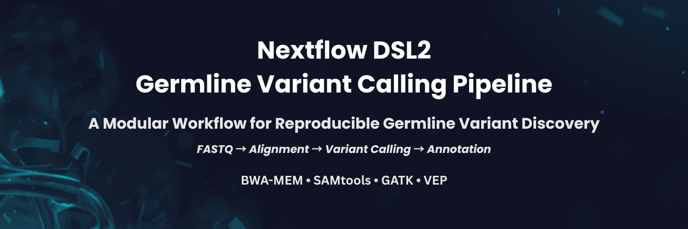
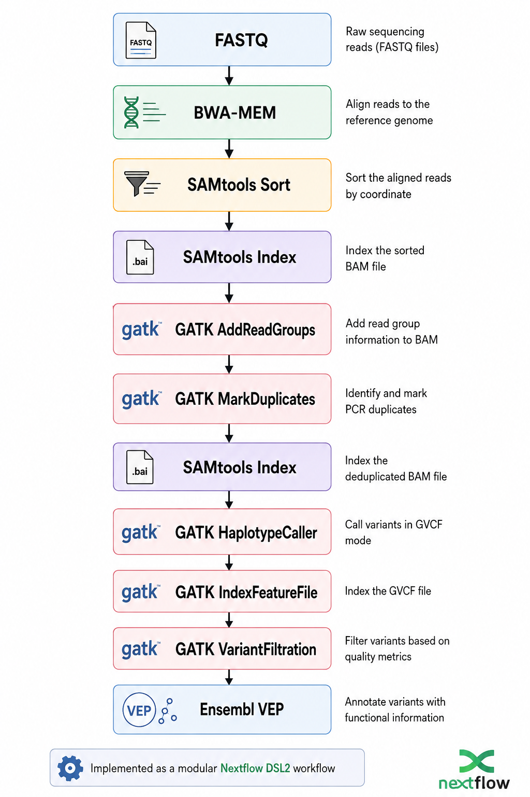
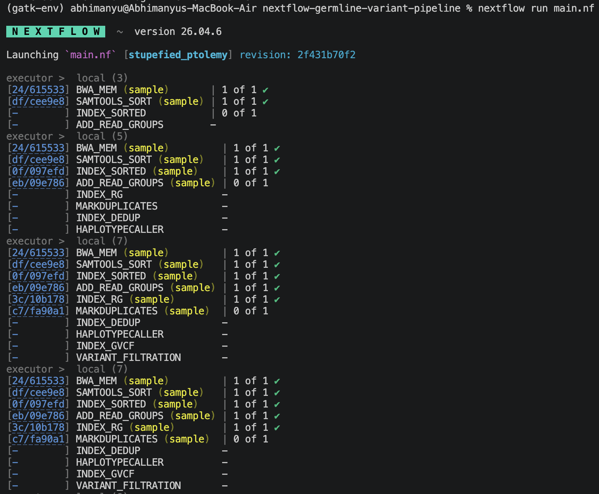
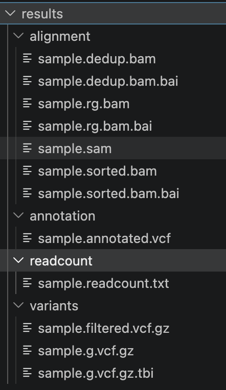

<p align="center">
  
</p>

<h1 align="center">Nextflow DSL2 Germline Variant Calling Pipeline</h1>

<p align="center">
A production-style modular Nextflow DSL2 workflow implementing the GATK Best Practices pipeline for germline variant discovery from FASTQ to functionally annotated variants.
</p>

<p align="center">


</p>

---

## Project Overview

This pipeline follows GATK Best Practices for germline variant discovery and demonstrates how modular Nextflow DSL2 workflows can be used to build reproducible bioinformatics pipelines.

It includes:

- Sequence Alignment
- BAM Sorting & Indexing
- Read Group Addition
- PCR Duplicate Marking
- Germline Variant Calling
- Variant Filtration
- Functional Annotation

---

## Workflow Diagram

The pipeline implements a modular Nextflow DSL2 workflow for germline variant discovery following GATK Best Practices.

<p align="center">
  
</p>

---

## Features

- Modular Nextflow DSL2 workflow
- Read alignment using **BWA-MEM**
- BAM sorting and indexing with **SAMtools**
- Read group assignment using **GATK AddOrReplaceReadGroups**
- PCR duplicate marking using **MarkDuplicates**
- Germline variant calling using **GATK HaplotypeCaller**
- Variant filtration using **GATK VariantFiltration**
- Functional annotation using **Ensembl VEP**
- Reproducible and scalable workflow execution
- Easily extensible modular architecture

---

## Technology Stack

- Nextflow DSL2
- Bash
- Linux
- BWA-MEM
- SAMtools
- GATK 4
- Ensembl VEP

---

## Pipeline Execution

The workflow is executed using Nextflow DSL2. Each module runs independently, enabling scalable, reproducible, and resumable execution.

<p align="center">
  
</p>

---

## Installation

### Clone the repository

```bash
git clone https://github.com/AbhimanyuMandal/nextflow-germline-variant-pipeline.git

cd nextflow-germline-variant-pipeline
```
### Requirements

- Nextflow ≥ 24.x
- Java 17+
- BWA
- SAMtools
- GATK 4
- Ensembl VEP

Ensure all tools are available in your system PATH before executing the workflow.

---

## Running the Pipeline

### Execute the workflow using:

```bash
nextflow run main.nf
```

### To resume an interrupted workflow:

```bash
nextflow run main.nf -resume
```
---

## Input

The pipeline expects:

```
test_data/
├── sample.fastq
```

Reference genome files should be placed inside:

```
reference/
├── toy_reference.fa
├── toy_reference.fa.fai
├── toy_reference.dict
├── ...
```

The reference genome must already be indexed before running the workflow.

---

## Generated Results

The pipeline automatically organizes results into separate directories for alignment, quality control, variant calling, and annotation.

<p align="center">
  
</p>

---

## Repository Structure

```text
nextflow-germline-variant-pipeline/

├── modules/
│   ├── alignment/
│   ├── gatk/
│   ├── qc/
│   └── annotation/
│
├── reference/
│
├── test_data/
│
├── results/
│
├── main.nf
├── nextflow.config
├── README.md
└── LICENSE
```

---

## Pipeline Modules

| Module | Purpose |
|---------|---------|
| BWA-MEM | Align reads to reference genome |
| SAMtools Sort | Coordinate sort BAM |
| SAMtools Index | Generate BAM index |
| AddReadGroups | Add sequencing metadata |
| MarkDuplicates | Remove PCR duplicates |
| HaplotypeCaller | Germline variant calling |
| VariantFiltration | Filter low-quality variants |
| VEP | Functional variant annotation |

---

## Future Improvements

- Integrate FastQC and MultiQC
- Base Quality Score Recalibration (BQSR)
- Joint Genotyping workflow
- Container support using Docker and Singularity
- Cloud execution on AWS and Google Cloud
- Support for multiple samples
- Workflow testing using GitHub Actions
- Parameter validation
- nf-core compatible configuration

---

# Acknowledgements

This workflow is inspired by the GATK Best Practices pipeline developed by the Broad Institute and implemented using Nextflow DSL2 modular design principles.

---

## License

This project is distributed under the MIT License.

See the LICENSE file for details.

---

## Contact

**Abhimanyu Mandal**

- LinkedIn: https://www.linkedin.com/in/abhimanyu-mandal/
- Portfolio: https://abhimanyumandal.github.io/Personal-Portfolio/
- Email: abhimanyumandal0810@gmail.com

---

<div align="center">

### ⭐ If you found this repository useful, please consider giving it a Star!

</div>
